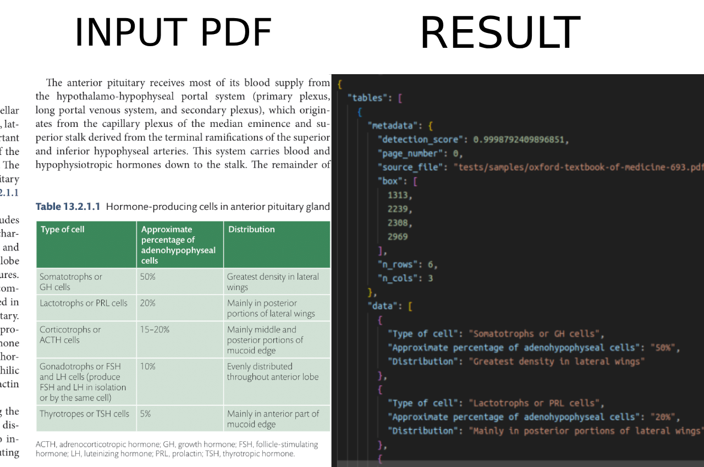

# Pdf2Table

A Python library for detecting, extracting, and processing tables from PDF documents.



## Overview

This project provides a robust solution for extracting tabular data from PDF documents using state-of-the-art computer vision models.

The extraction pipeline implements a **4-step methodology**:
1. **PDF Rendering** - Convert pages to high-resolution images with text extraction
2. **Table Detection** - Identify table regions using transformer models
3. **Structure Recognition** - Detect cells, rows, columns, and headers
4. **Grid Construction** - Build structured grids with intelligent text extraction (direct PDF + OCR fallback)

## Technologies Used

- **Table Transformer Models** (Microsoft Research): Detection and structure recognition
- **PyMuPDF (fitz)**: PDF processing and rendering with direct text extraction
- **TrOCR** (Microsoft): Optional OCR fallback for scanned documents
- **Transformers** (Hugging Face): Model inference pipeline
- **Pydantic**: Entity validation and data modeling

## Features

- **Advanced Table Detection**: High-confidence table region identification using transformer models
- **Structure Recognition**: Automatic detection of cells, merged cells, headers, rows, and columns
- **Intelligent Text Extraction**: Two-stage approach (direct PDF text + OCR fallback)
- **Flexible Configuration**: Customizable thresholds, DPI, and processing options
- **Clean Architecture**: Well-organized codebase following software engineering best practices
- **Comprehensive Logging**: Detailed logs for debugging and monitoring
- **Multiple Output Formats**: JSON export with metadata and structured data

## Installation

```bash
# Install the package in development mode
pip install -e .
```

### Usage
```python
from pdf2table.frameworks.pipeline import create_pipeline

# Create the extraction pipeline with configuration
pipeline = create_pipeline(
    device="cpu",
    detection_threshold=0.9,
    structure_threshold=0.6,
    pdf_dpi=300,
    load_ocr=False,
    visualize=False
)

# Extract tables from a specific page
response = pipeline.extract_tables(pdf_path="document.pdf", page_number=0)

# Or extract tables from all pages
response = pipeline.extract_tables(pdf_path="document.pdf")

# Check if extraction was successful
if response.success:
    print(f"Successfully extracted {len(response.tables)} tables")
    
    # Access extracted tables
    for table in response.tables:
        print(f"Table with {len(table.grid.cells)} cells")
        print(f"Grid size: {table.grid.n_rows} x {table.grid.n_cols}")
    
    # Convert to dictionary format
    result_dict = response.to_dict()
    print(result_dict)
    
    # Save results to JSON file
    response.save_to_json("output/extracted_tables.json")
else:
    print(f"Extraction failed: {response.error_message}")
```

### Configuration Options

The `create_pipeline()` method accepts the following parameters:

- `device` (str): Device for ML models - "cpu" or "cuda" (default: "cpu")
- `detection_threshold` (float): Confidence threshold for table detection (default: 0.9)
  - High (0.9+): Fewer false positives, may miss some tables
  - Medium (0.7-0.9): Balanced detection
  - Low (<0.7): More tables detected, more false positives
- `structure_threshold` (float): Confidence threshold for structure recognition (default: 0.6)
  - High (0.8+): Clean structure, may miss some cells
  - Medium (0.5-0.8): Balanced recognition (recommended)
  - Low (<0.5): Detects more cells, more noise
- `pdf_dpi` (int): DPI for PDF page rendering (default: 300)
  - 150: Faster processing, lower quality
  - 300: Balanced (recommended)
  - 600+: Better quality, slower processing
- `load_ocr` (bool): Whether to load OCR service (default: False)
  - False: Direct PDF text extraction only (faster, recommended for native PDFs)
  - True: Enable TrOCR fallback (essential for scanned documents)
- `visualize` (bool): Whether to enable visualization (default: False)
- `visualization_save_dir` (str): Directory to save visualizations (default: "data/table_visualizations")

## 📋 Logging

The project includes comprehensive logging capabilities for debugging and monitoring:

**Log Files**: By default, logs are written to:
- `logs/pdf2table.log` - Main application log
- `logs/pdf2table_errors.log` - Error-only log

**Documentation**: See `docs/logging_guide.md` for detailed logging documentation.

## 🏗️ Architecture

The project follows **Clean Architecture** with three main layers:

- **Entities Layer**: Core business objects (PageImage, DetectedTable, TableGrid, GridCell)
- **Use Cases Layer**: Business logic orchestration (TableExtractionUseCase, TableGridBuilder)
- **Frameworks Layer**: External tools (PyMuPDF, Table Transformer, TrOCR)

For detailed technical documentation, see `docs/technical_report/technical_report.md`.

## 🎯 Use Cases

### Document Processing Pipelines
- **Financial Reports**: Extract financial tables from annual reports and earnings statements
- **Research Papers**: Extract data tables from scientific publications
- **Invoice Processing**: Extract line items and totals from invoices
- **Government Documents**: Process regulatory filings and public documents

### Integration Scenarios
- **Data Analytics**: Feed extracted data into analytical workflows  
- **Document Management**: Enhance document search with structured table data
- **Compliance**: Automated extraction for regulatory compliance reporting
- **Business Intelligence**: Convert PDF reports into structured datasets for analysis

## 🤝 Contributing

1. Fork the repository
2. Create a feature branch (`git checkout -b feature/amazing-feature`)
3. Follow Clean Architecture principles
4. Add comprehensive tests
5. Update documentation
6. Submit a pull request

## 📄 License

This project is licensed under the MIT License - see the LICENSE file for details.

## 🙏 Acknowledgments

- **Microsoft Research**: Table Transformer models
- **Hugging Face**: TrOCR and Transformers library  
- **PyMuPDF Team**: Excellent PDF processing capabilities
