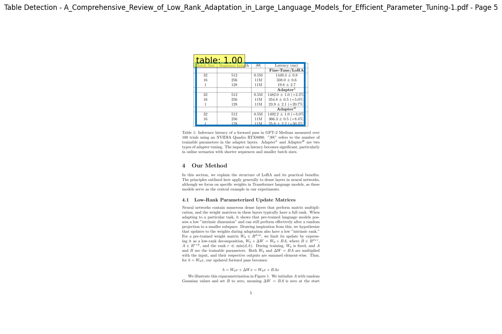
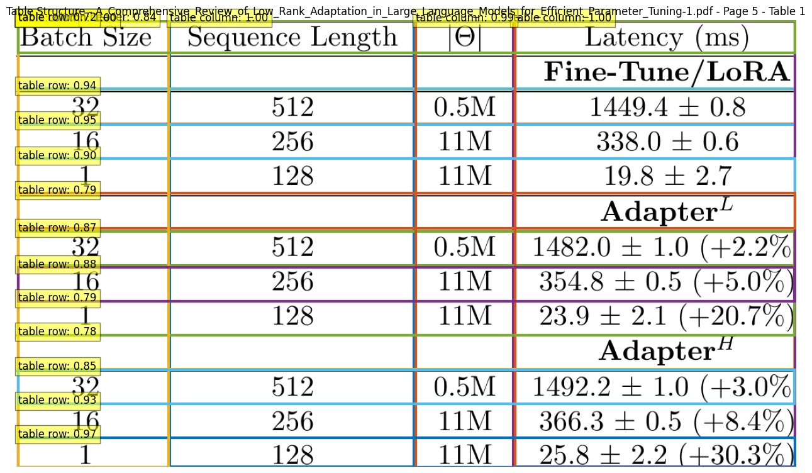
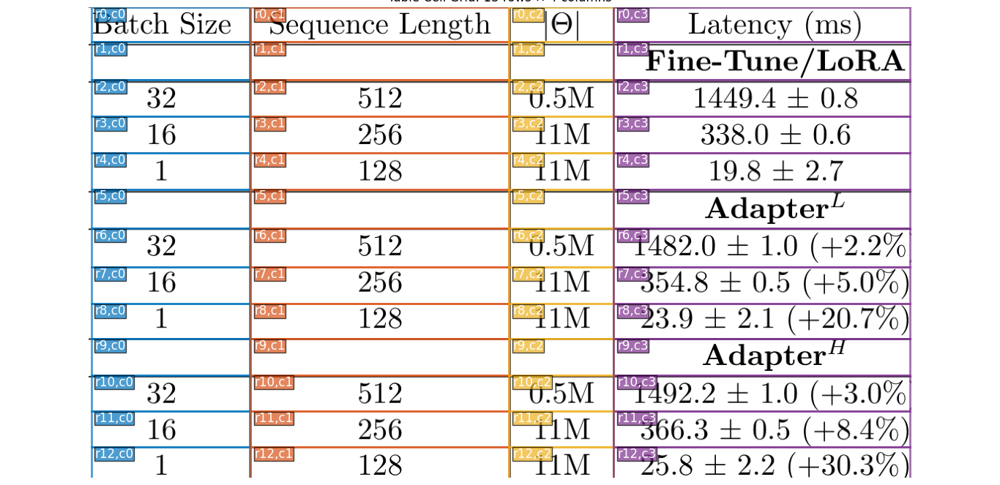
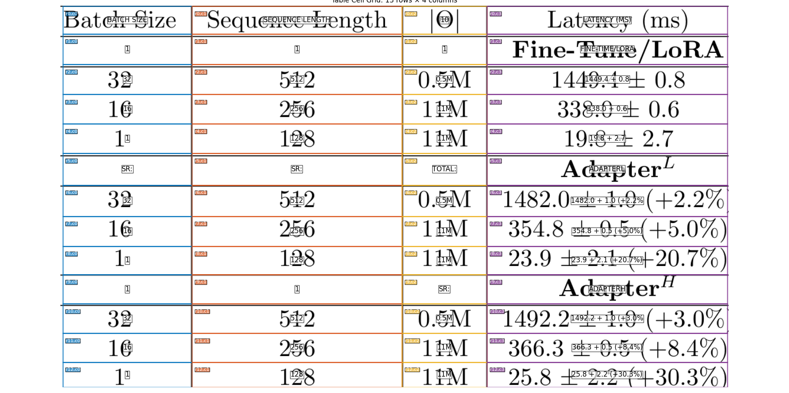

# Pdf2Table: Technical Report

**Version:** 1.0  
**Date:** October 18, 2025  
**Project:** PDF Table Extraction System

---

## Executive Summary

Pdf2Table is a Python library that implements a robust table extraction system from PDF documents using state-of-the-art computer vision models. The system follows Clean Architecture principles and leverages Microsoft's Table Transformer models for table detection and structure recognition, combined with PyMuPDF for direct text extraction and TrOCR as an optional OCR fallback.

---

## 1. System Architecture

The project follows Clean Architecture principles with clear separation of concerns across three main layers:

```
┌─────────────────────────────────────────────────────────────┐
│                    External Interface                        │
│                  (Pipeline Factory)                          │
└─────────────────────┬───────────────────────────────────────┘
                      │
┌─────────────────────▼───────────────────────────────────────┐
│                   Use Cases Layer                            │
│  - TableExtractionUseCase (orchestration)                   │
│  - TableGridBuilder (grid construction)                      │
│  - Services (validation, clustering)                         │
└─────────────────────┬───────────────────────────────────────┘
                      │
┌─────────────────────▼───────────────────────────────────────┐
│                  Entities Layer                              │
│  - PageImage, DetectedTable, TableGrid                      │
│  - BoundingBox, DetectedCell, GridCell                      │
└─────────────────────┬───────────────────────────────────────┘
                      │
┌─────────────────────▼───────────────────────────────────────┐
│            Frameworks & Drivers Layer                        │
│  - PyMuPDFImageExtractor (PDF processing)                   │
│  - TableTransformerDetector (table detection)               │
│  - TableTransformerStructureRecognizer (structure)          │
│  - TrOCRService (OCR)                                       │
└─────────────────────────────────────────────────────────────┘
```

---

## 2. Core Methodology: 4-Step Extraction Pipeline

The table extraction process follows four key steps, each building upon the previous one:

### Step 1: PDF Page Rendering and Text Extraction

**Component:** PyMuPDFImageExtractor

**Process:**
1. Render PDF page to high-resolution image (default 300 DPI)
2. Extract word-level text with precise bounding box coordinates
3. Convert RGBA to RGB format
4. Create PageImage entity with both image data and text positions

**Output:** PageImage containing rendered image and word positions for direct text extraction

---

### Step 2: Table Detection

**Component:** TableTransformerDetector  
**Model:** `microsoft/table-transformer-detection`

**Process:**

The detection model scans the rendered page image to identify regions that contain tables. The process involves:

1. **Image Preprocessing**: The page image is normalized and prepared in the format expected by the transformer model
2. **Model Inference**: The pre-trained detection model analyzes the image and predicts bounding boxes around potential table regions
3. **Results Post-processing**: Raw model outputs are converted into clean bounding box coordinates
4. **Confidence Filtering**: Only detections with confidence scores above the threshold (default 0.9) are retained to minimize false positives
5. **Entity Creation**: Each validated detection is wrapped in a DetectedTable object containing the bounding box, confidence score, page number, and source file metadata

**Output:** List of DetectedTable objects with bounding boxes and confidence scores



---

### Step 3: Table Structure Recognition

**Component:** TableTransformerStructureRecognizer  
**Model:** `microsoft/table-transformer-structure-recognition`

**Process:**

For each detected table, this step identifies the internal structure - individual cells, rows, and columns:

1. **Table Cropping**: The detected table region is extracted from the full page image using its bounding box coordinates
2. **Image Preprocessing**: The cropped table image is normalized and prepared for the structure recognition model
3. **Structure Inference**: The model analyzes the table image and predicts the location and type of structural elements
4. **Cell Classification**: Each detected element is classified into one of several types:
   - **table row**: Horizontal row separators
   - **table column**: Vertical column separators
   - **table cell**: Standard data cells
   - **table spanning cell**: Merged cells that span multiple rows or columns
   - **table column header**: Header cells
5. **Coordinate Transformation**: Detected cell coordinates (relative to the cropped image) are converted to absolute page coordinates
6. **Entity Creation**: Each structural element is packaged as a DetectedCell object with its bounding box, type, and confidence score

**Output:** List of DetectedCell objects representing table structure



---

### Step 4: Grid Construction and Text Extraction

**Component:** TableGridBuilder

This is the most critical step that converts detected cells into a structured grid with extracted text content.

**Process:**

**Phase 1: Edge Collection**

The system collects all unique boundary coordinates from detected cells:
- Extract the top and bottom edges (y_min, y_max) from each cell to form potential row boundaries
- Extract the left and right edges (x_min, x_max) from each cell to form potential column boundaries
- These edges represent all possible grid lines in the table

**Phase 2: Coordinate Clustering**

Raw edge coordinates are often noisy (cells may be slightly misaligned). The clustering algorithm groups nearby coordinates:

- **Sort and Deduplicate**: Organize all coordinates in ascending order and remove exact duplicates
- **Dynamic Threshold Calculation**: Analyze the spacing between coordinates to determine an appropriate clustering threshold
  - For tightly-spaced coordinates (< 5 pixels apart), use a smaller threshold to preserve fine details
  - For widely-spaced coordinates, use a larger threshold (70% of mean spacing) to group alignments
- **First Pass Clustering**: Group coordinates that are within the threshold distance into clusters
- **Center Calculation**: Compute the average position of each cluster to get clean grid line positions
- **Second Pass Merging**: Merge cluster centers that are still very close together (within half the threshold)
- **Result**: A clean set of row and column boundaries that define the grid structure

**Phase 3: Grid Cell Assignment (Overlap-Based)**

Create a structured grid and assign detected cells to grid positions:

- **Define Grid Dimensions**: Calculate the number of rows (gaps between row boundaries) and columns (gaps between column boundaries)
- **Initialize Grid**: Create an empty grid structure indexed by (row, column) positions
- **Overlap Detection**: For each grid position, find all detected cells whose bounding boxes overlap that position
- **Confidence-Based Selection**: If multiple cells overlap the same grid position, select the one with the highest confidence score
- This approach naturally handles merged cells, as they will be assigned to multiple grid positions




**Phase 4: Text Extraction (Two-Stage Approach)**

Extract text content for each cell in the grid using a fallback strategy:

**Stage 1: Direct PDF Text Extraction (Primary Method)**
- Create a rectangular region for the cell using its grid boundaries
- Query the PDF's embedded text layer to find all words whose bounding boxes intersect with the cell region
- Concatenate the intersecting words with spaces to form the cell text
- This method is fast and accurate for PDFs with embedded text

**Stage 2: OCR Fallback (Secondary Method)**
- If direct extraction returns empty or fails, crop the cell region from the page image
- Pass the cropped cell image to the TrOCR model for optical character recognition
- This handles scanned documents, images, or complex formatting where direct extraction fails

**Result**: Each grid position gets a text value, creating a complete structured table

**Output:** TableGrid with structured GridCell objects containing position, text, and metadata



---

## 3. Complete Data Flow

```
Raw PDF
    ↓
[Step 1] PyMuPDFImageExtractor
    ↓
PageImage (np.ndarray + words)
    ↓
[Step 2] TableTransformerDetector
    ↓
DetectedTable (BoundingBox + metadata)
    ↓
[Step 3] TableTransformerStructureRecognizer
    ↓
List[DetectedCell] (BoundingBox + type + confidence)
    ↓
[Step 4] TableGridBuilder
    ↓
TableGrid (List[GridCell] + dimensions)
    ↓
List[Dict[str, str]] (Row format with headers)
    ↓
JSON Output
```

---

## 4. Configuration Parameters

### Detection Threshold
- **High (0.9+):** Fewer false positives, may miss some tables
- **Medium (0.7-0.9):** Balanced detection
- **Low (<0.7):** More tables detected, more false positives

### Structure Threshold
- **High (0.8+):** Clean structure, may miss some cells
- **Medium (0.5-0.8):** Balanced recognition (recommended)
- **Low (<0.5):** Detects more cells, more noise

### PDF DPI
- **Low (150):** Faster processing, lower quality
- **Medium (300):** Balanced (recommended)
- **High (600+):** Better quality, slower processing

### OCR Toggle
- **Disabled (load_ocr=False):** Direct PDF text extraction (faster, recommended for native PDFs)
- **Enabled (load_ocr=True):** TrOCR fallback (essential for scanned documents)

---

## 5. Output Format

### TableExtractionResponse Structure

```json
{
  "success": true,
  "source_file": "document.pdf",
  "tables": [
    {
      "metadata": {
        "detection_score": 0.95,
        "page_number": 0,
        "source_file": "document.pdf",
        "box": [100, 200, 800, 600],
        "n_rows": 5,
        "n_cols": 3
      },
      "data": [
        {
          "Header 1": "Cell 1,1",
          "Header 2": "Cell 1,2",
          "Header 3": "Cell 1,3"
        },
        {
          "Header 1": "Cell 2,1",
          "Header 2": "Cell 2,2",
          "Header 3": "Cell 2,3"
        }
      ]
    }
  ]
}
```

---

## 6. Known Limitations

### Complex Table Structures
- **Merged Cells:** Handled by overlap-based algorithm, assigned to multiple grid positions
- **Nested Tables:** Not supported
- **Rotated Tables:** Not handled, requires preprocessing

### Text Extraction
- **Multi-line Cells:** Text concatenated with spaces
- **Non-English Text:** TrOCR base model optimized for English

---

## 7. References

### Models
- **Table Transformer Detection:** `microsoft/table-transformer-detection`
- **Table Transformer Structure:** `microsoft/table-transformer-structure-recognition`
- **TrOCR:** `microsoft/trocr-base-printed`

### Libraries
- **PyMuPDF (fitz):** PDF processing and rendering
- **Transformers (Hugging Face):** Model loading and inference
- **Pydantic:** Entity validation
- **NumPy:** Image array operations

---

**End of Technical Report**
